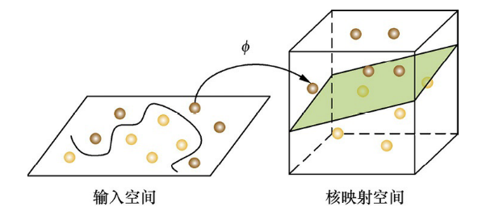

# 1 特征工程

- 特征的类型？结构化数据（关系型数据库的一张表）、非结构化数据（文本、图像、音频）
- 为什么要做特征工程？去除特征冗余，设计高效特征求解与预测模型之间的关系。

## 1.1 特征归一化
- 目的：消除特征量纲的影响，将所有特征数值统一到一个大致相同的数值区间
- 方式：线性函数归一化`[0,1]`、零均值归一化`N(0,sigma)`
- 效果：适用于依赖数值范围的机器学习方法（梯度下降，如逻辑回归、SVM、神经网络）。不适用于如决策树，信息增益的计算与归一化无关。

## 1.2 类别型特征
- 处理方式：序号编码、二进制表示、独热编码（One-Hot)

## 1.3 高维特征的处理
- 问题来源：特征的类别、类别下的个体独热编码。
- 应对思路：降维。如推荐系统的矩阵分解
- 如何降维？？TODO

## 1.4 组合特征
- 问题来源：如何高效降维，找到有效的组合特征
- 决策树（梯度提升决策树，大致意思是把冗余的特征组合成一个）、矩阵分解。

## 1.5 文本表示模型
- 问题来源：文本特征表示
- 具体方法：
  - 词袋模型（BoG，每篇文章用N个词表示，不考虑词的顺序，每个词作为单独一维特征，数值计算考虑两个维度：1、该词在文章出现的频率；2、出现过该词的文章的概率）
  - N-gram词组模型：多个单词看做一个词组代替词袋模型的单个单词。
  - 主题模型：高于词组，加入主题，如LDA（隐狄利克雷模型）
  - 词嵌入与深度学习模型：每个词映射成低维空间（K=50~300维）的稠密向量。深度学习的嵌入学习效果更好。

## 1.6 Word2Vec
- 知识点：Word2Vec, ~~LDA隐狄利克雷函数~~，CBOW，Skip-Gram
- Word2Vec的训练：conditional BOG + skip-Gram，训练2层的神经网络NxK, KxN，然后Softmax拟合 
- 

## 1.7 图像数据不足时的处理方法
- 知识点：迁移学习、生成对抗网络、图像处理、上采样技术、数据扩充
- 基于模型的方法：简化模型降低非线性、添加正则化减小假设空间、集成学习、Dropout等
- 基于数据的方法：数据扩充噪声、色彩、空间变化，生成对抗网络

# 2 模型评估

- 离线评估与在线评估
- 分类、排序、回归、序列预测

## 2.1 评价指标的局限性
- 分类的准确率的局限性
- 排序的PR曲线
  - Precision@N：找到的可信度
  - Recall@N：找全的能力
  - F1 Score
- 回归的RMSE的奇异值影响

## 2.2 ROC曲线
- 问题来源：二分类的指标评价
- 应用背景：军事雷达预警、医院病情诊断
- 关注点：阳性样本（在军事医疗上信息量很大）
- 作图：TPR/FPR，TPR=TP/P, FPR=FP/N
- 特点：
  - 1 关注计算的全都是预测为阳性的
  - 2 分母是两个类别的个数
- 与PR曲线的比较
  - 1 各有应用场景，针对指标衡量的需要而选择
  - 2 对于样本分布变化，ROC比PR更稳定。（从分母上可以看出，同时从P准确率的计算也可以理解）

## 2.3 余弦距离的应用
- 为什么用余弦距离？大多数情况，需要衡量相对距离，不关心每个参数的具体值（登录次数与时长，(1,10)和(10,100)）
- 与欧氏距离的比较？归一化后与欧氏距离单调
- 余弦距离是严格的距离吗？不是，欧式距离满足三角不等式，在单位圆上，余弦距离与欧氏距离满足二阶关系，肯定不满足
  - 正定性（都是正数）
  - 对称性
  - 满足三角不等式（两点距离，直线最短）

## 2.4 A/B测试的陷阱
- 什么是A/B测试？线上场景随机分配实验、对照组，新模型A对比与之前模型B的效果
- 为什么A/B测试？离线测试考虑不到线上运行的全新样本、工程时延等实际业务问题。
- 实验组、对照组的划分方法？完全随机、针对特定用户

## 2.5 模型评估的方法
- Holdout：无放回采样
- K折交叉验证：分成K组，分别作为K次的测试集，最后取平均
- 自助法Bootstrap与平均概率：有放回采样，没采样到的作为测试集，平均测试集概率为1/e。
  - 小样本下怎么就不影响训练规模了？哦，随时记录训练的序号，没训练的做测试。

## 2.6 超参数调优
- 网格搜索：耗时高
- 随机搜索：一般更快，最终更容易接近最优值
- ~~贝叶斯优化算法~~
  - 对目标函数形状做学习
  - 利用之前的超参信息

## 2.7 过拟合与欠拟合
- 现象描述
- 降低过拟合的方法
  - 数据
  - 模型复杂度
  - 正则化
  - 集成学习
- 降低欠拟合的方法
  - 增加新特征
  - 模型复杂度
  - 减少正则化

# 3 经典算法
- 没有大量数据的领域适用

## 3.1 支持向量机
- 核心思想？对于特征过于耦合的情况，在原始平面无法线性区分，则将特征向高维平面映射。映射利用核函数。
- 在空间上线性可分的两类点，分别向SVM分类的超平面做投影，这些点还是线性可分的吗？不是。
  - 如果线性可分，则可找到更优的超平面。
  - 凸优化理论的超平面分离定理：对不相交的两个凸集，存在一个超平面，将两个凸集分离，对于二维情况，凸集间距离最短两点的中垂线就是将他们分开的超平面。
- 是否存在一组参数，使SVM训练误差为0？
  - 是的，对于高斯核而言，只要两个标签的训练集没有公共交点，一定能找到一组参数，使SVM训练误差为0。
- 误差为0的分类器一定存在吗？不加入松弛向量时，一定存在。
- 加入松弛向量时，训练误差能为0吗？会趋近于找一个带训练误差，但参数较小的点。

## 3.2 逻辑回归
- 与线性回归相比的异同？逻辑回归是分类问题，线性回归是回归问题。逻辑回归预测因变量的期望，线性回归预测真实数值。
- 几率Odd的概念？事件发生概率与不发生的比值p/(1-p)
- 为什么叫“逻辑回归”？约束log[p/(1-p)]，相当于对几率的回归
- 与线性回归的相似点？梯度下降优化
- 多标签问题？假设样本服从几何分布，用多项逻辑回归来分类（Softmax Regression）。
  - 多项逻辑回归的冗余特点：对参数加减同一个数后结果不变。
- 多类别问题？
  - 训练K个二分类模型

## 3.3 决策树
决策树是最基础、常见的有监督模型，在医药、销售很适用，因为与机理相似。

- 决策树的启发函数？
  - 构建最优的树是一个NP完全问题
  - ID3算法：最大信息增益
  - C4.5：最大信息增益比
  - CART：最大基尼系数
- 如何减小过拟合？剪枝
  - 预剪枝：early stopping
  - 后剪枝：由于参数的可解释性，能在测试集上判断后剪枝效果
  - 剪枝比构建更为关键
- 奥卡姆剃刀思想：用最简单但有效的方法解决问题，因为解释性、泛化强、反映问题的内在规律。
