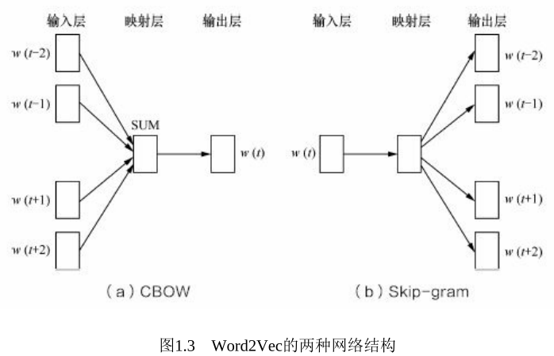

# 1 特征工程

- 特征的类型？结构化数据（关系型数据库的一张表）、非结构化数据（文本、图像、音频）
- 为什么要做特征工程？去除特征冗余，设计高效特征求解与预测模型之间的关系。

## 1.1 特征归一化
- 目的：消除特征量纲的影响，将所有特征数值统一到一个大致相同的数值区间
- 方式：线性函数归一化`[0,1]`、零均值归一化`N(0,sigma)`
- 效果：适用于依赖数值范围的机器学习方法（梯度下降，如逻辑回归、SVM、神经网络）。不适用于如决策树，信息增益的计算与归一化无关。

## 1.2 类别型特征
- 处理方式：序号编码、二进制表示、独热编码（One-Hot)

## 1.3 高维特征的处理
- 问题来源：特征的类别、类别下的个体独热编码。
- 应对思路：降维。如推荐系统的矩阵分解
- 如何降维？？TODO

## 1.4 组合特征
- 问题来源：如何高效降维，找到有效的组合特征
- 决策树（梯度提升决策树，大致意思是把冗余的特征组合成一个）、矩阵分解。

## 1.5 文本表示模型
- 问题来源：文本特征表示
- 具体方法：
  - 词袋模型（BoG，每篇文章用N个词表示，不考虑词的顺序，每个词作为单独一维特征，数值计算考虑两个维度：1、该词在文章出现的频率；2、出现过该词的文章的概率）
  - N-gram词组模型：多个单词看做一个词组代替词袋模型的单个单词。
  - 主题模型：高于词组，加入主题，如LDA（隐狄利克雷模型）
  - 词嵌入与深度学习模型：每个词映射成低维空间（K=50~300维）的稠密向量。深度学习的嵌入学习效果更好。

## 1.6 Word2Vec
- 知识点：Word2Vec, ~~LDA隐狄利克雷函数~~，CBOW，Skip-Gram
- Word2Vec的训练：conditional BOG + skip-Gram，训练2层的神经网络NxK, KxN，然后Softmax拟合 
- 

## 1.7 图像数据不足时的处理方法
- 知识点：迁移学习、生成对抗网络、图像处理、上采样技术、数据扩充
- 基于模型的方法：简化模型降低非线性、添加正则化减小假设空间、集成学习、Dropout等
- 基于数据的方法：数据扩充噪声、色彩、空间变化，生成对抗网络

# 2 模型评估

- 离线评估与在线评估
- 分类、排序、回归、序列预测

## 2.1 评价指标的局限性
- 分类的准确率的局限性
- 排序的PR曲线
  - Precision@N：找到的可信度
  - Recall@N：找全的能力
  - F1 Score
- 回归的RMSE的奇异值影响

## 2.2 ROC曲线
- 问题来源：二分类的指标评价
- 应用背景：军事雷达预警、医院病情诊断
- 关注点：阳性样本（在军事医疗上信息量很大）
- 作图：TPR/FPR，TPR=TP/P, FPR=FP/N
- 特点：
  - 1 关注计算的全都是预测为阳性的
  - 2 分母是两个类别的个数
- 与PR曲线的比较
  - 1 各有应用场景，针对指标衡量的需要而选择
  - 2 对于样本分布变化，ROC比PR更稳定。（从分母上可以看出，同时从P准确率的计算也可以理解）

## 2.3 余弦距离的应用

## 2.4 A/B测试的陷阱

## 2.5 模型评估的方法

## 2.6 超参数调优

## 2.7 过拟合与欠拟合
